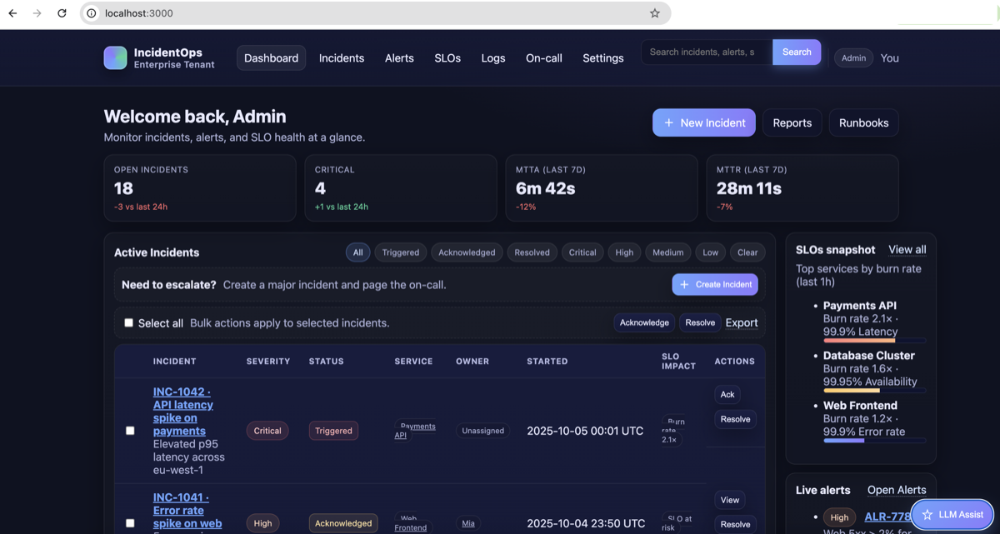
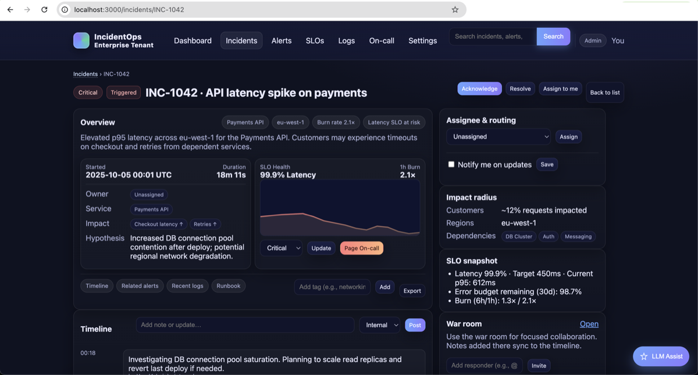

# serve-llm

Serve-llm is a cheeky thought experiment, not a production stack: instead of vibe-coding a frontend and backend, you picture the page you want and let an LLM improvise the entire view—markup, copy, flow—on every request. The CLI (`npx serve-llm`) keeps a rolling history per session to feed better prompts and power the admin console, but each navigation is still a fresh act of hallucination with full interactivity. It’s intentionally unserious; half the joy is watching the model make it up as it goes.

It’s also a rapid-prototyping cheat code: why spend a weekend wiring a throwaway backend and pixel-tweaking a frontend just to sanity-check a UX flow or study a short interaction? Let the model “predict” what the app would render—if it quacks like a duck, that might be enough to validate the idea before investing real build time.

---

## Get Started in 60 Seconds 🚀

All you need is **Node.js (v20+, ideally 24)** and an API key from OpenAI, Google Gemini, Anthropic, or xAI Grok.

1.  **Launch the server:**

    ```bash
    npx github:gerkensm/serve-llm
    ```

2.  **Follow the wizard:**
    The command opens a setup wizard in your browser at `http://localhost:3000`. Just pick your provider, drop in your API key, and write your first brief. That's it. The app will open in a new tab, and the original tab becomes your admin console.

<details>
<summary><strong>Prefer the command line?</strong></summary>

- **Pass a brief directly:** `npx github:gerkensm/serve-llm "You are a mood journal"`
- **Choose a provider:** Use `--provider <openai|gemini|anthropic|grok>` or set an environment variable (`OPENAI_API_KEY`, `GEMINI_API_KEY`, `ANTHROPIC_API_KEY`, or `XAI_API_KEY`/`GROK_API_KEY`).
- **Override the model:** Use `--model <model-identifier>` to pick a specific variant, like `grok-3-mini`.
- **Tune history:** Use `--history-limit` and `--history-bytes` to control how much context is fed back to the model.
- **Change the port:** Use `--host <address>` and `--port <number>` to bind the server elsewhere.

</details>

---

## Demo: From Brief to Interactive App

Watch how a single brief turns into an improv UI loop. The model invents an enterprise incident tracker, gets feedback via the AI Assist panel to fix a CSS bug, and then hallucinates a consistent detail page on the fly.

https://github.com/user-attachments/assets/749b04c7-7684-4e6f-ad46-98379bb63364

Prefer a GIF? Grab [assets/demo/incident-walkthrough.gif](assets/demo/incident-walkthrough.gif) (~2.2 MB).

<details>
<summary><strong>Step-by-step screenshots</strong></summary>

| Step | Preview                                                                                       | What happened                                                                                                                                                     |
| ---- | --------------------------------------------------------------------------------------------- | ----------------------------------------------------------------------------------------------------------------------------------------------------------------- |
| 1    | [](assets/screenshot0.png)         | The CLI launches the brief form at `http://localhost:3000`, where the enterprise incident-tracker prompt is pasted into the textarea before starting the session. |
| 2    | [](assets/screenshot1.png)      | The landing view loads with a richly styled overview of active incidents, but a styling glitch causes the incident badges to overlap when they wrap.              |
| 3    | [](assets/screenshot2.png) | Using the floating `AI Assist` panel, the admin submits a fix request describing the badge overlap issue.                                                         |
| 4    | [](assets/screenshot3.png)             | The regenerated page applies the patch: badges now stay on a single line, and an inline note confirms the change the model just made.                             |
| 5    | [](assets/screenshot4.png)        | Clicking an incident ID (INC-1042) opens a fully fabricated detail view that keeps the theme, data tone, and interaction model consistent with the overview.      |

</details>

---

# The Vibe-Driven Request Cycle

<details>
<summary><strong>View the request cycle diagram</strong></summary>

```mermaid
graph TD
    subgraph Browser
        A[User Clicks Link or Submits Form] --> B;
        H[Page Re-renders] --> A;
    end

    subgraph "serve-llm Server"
        B(HTTP Request Receives) --> C[Assembles Prompt<br/>- App Brief<br/>- Request Details<br/>- Session History];
        C --> D{LLM Provider API};
        E --> F[Updates Session History];
        F --> G(Sends HTML Response);
    end

    subgraph "LLM Provider"
      D -- Sends Prompt --> LLM[OpenAI / Gemini / Anthropic / Grok];
      LLM -- Generates Full HTML --> E(Receives HTML);
    end

    G --> H;

    classDef user fill:#e0f2fe,stroke:#0ea5e9,stroke-width:2px;
    classDef server fill:#f0f9ff,stroke:#3b82f6,stroke-width:2px;
    classDef llm fill:#fefce8,stroke:#eab308,stroke-width:2px;

    class A,H user;
    class B,C,E,F,G server;
    class D,LLM llm;
```

</details>

---

## Features

- **Truly No-Code:** No frontend framework, no backend logic. The LLM improvises the entire interactive experience on every click.
- **Multi-Provider Playground:** Swap between OpenAI, Google Gemini, Anthropic, and xAI Grok on the fly. See how different models interpret the same brief.
- **Effortless Setup:** Forget config files. A slick browser-based wizard gets your API key and initial brief configured in moments.
- **AI-Powered Hot-Fixes:** Use the floating AI Assist panel to give the model live feedback. "Make the buttons rounder" or "Fix this layout bug"—and watch it regenerate the page.
- **Model "Thinking" Traces:** Enable reasoning mode to see the model's chain-of-thought, giving you a peek into how it decided to render the page.

---

## The Admin Console is Your Cockpit

Once your app is running, the admin interface at `/serve-llm` becomes your mission control. It's packed with tools for steering the creative chaos:

- **Live Controls:** Tweak the global brief, adjust history limits, or toggle the AI Assist panel without restarting the server.
- **Provider Management:** Switch between OpenAI, Gemini, Anthropic, and xAI Grok. Change models or update API keys with a few clicks.
- **History Explorer:** Inspect every generated page with expandable reasoning traces, token usage stats, and raw HTML output.
- **Session Time-Travel & Export:** Download the entire session as a JSON snapshot to save your work, then drag-and-drop it back in to restore the exact state. You can also export a `prompt.md` file—a perfect, human-readable blueprint of your app's flow, ready to hand off to an agent as a basis for real development.

---

## Prompt Ideas

- **Plausible Web Replica** – `You are a website simulator. Inspect the request path for a URL (e.g. /wikipedia.com) and render a believable page as if you operated that domain. Recreate navigation, copy, and structure. Route all links through yourself so the next turn can “browse” correctly. Never acknowledge this is synthetic—commit fully to the fiction.`
- **Delightful Shopping Lists** – `You are a multi-list shopping companion with gorgeous, modern UX. Persist user data by resubmitting every list and item with each response. Support creating, renaming, and checking off items across multiple lists, and keep interactions accessible and joyful.`

---

## Developing

- `nvm use` → `npm install` → `npm run dev` for live-reloading.
- The CLI entry point is `src/index.ts`. Prompts and server logic live under `src/`.
- The `dist/` output is committed so `npx` consumers get a frictionless run. Remember to `npm run build` before committing changes.
- Set `LOG_LEVEL` (`debug`, `info`, `warn`) to control log verbosity.

---

## Why Bother?

This project is a thought experiment in “vibe non-coding”: hold the UI in your head, let the LLM hallucinate the page, and embrace the chaos that follows when the model riffs on every route. It is intentionally unserious—and surprisingly fun.
